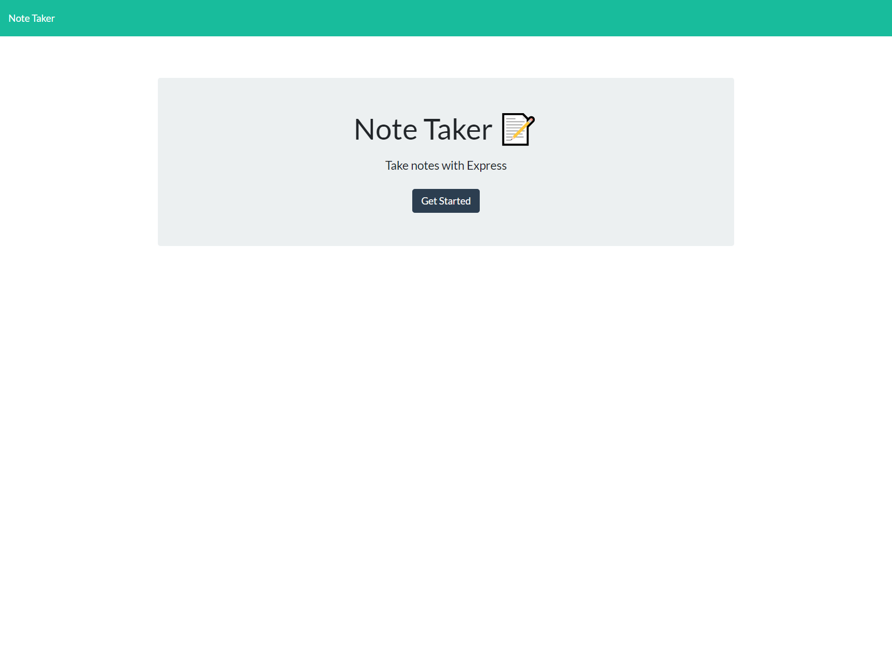
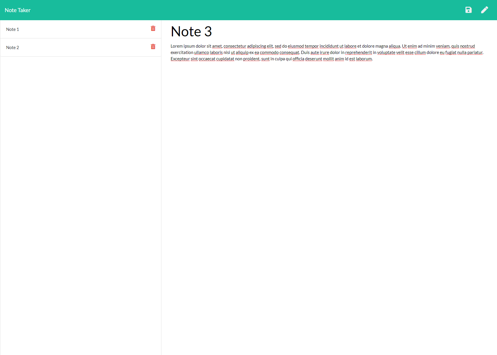

# Joseph Prospero's Note Taker App
Hello, this is my Note Taker App. It allows the user to write down notes, title, and save them. The user is also able to edit the saved notes. Given the majority of this assignment, the back end is primarily made up of Node and Javascript.

## Screenshots

## Deployed Link
https://handy-dandy-notetaker.herokuapp.com/

## Repo Link
https://github.com/josephprospero/note-taker

